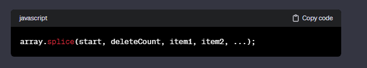
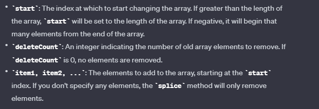
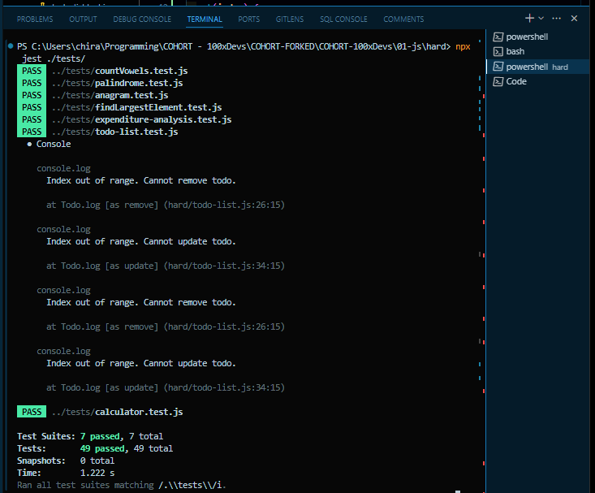

# hard-section - Calculator.js:

### eval function in js :

The eval function in JavaScript is a global function that evaluates a string as JavaScript code and executes it. It can take any valid JavaScript expression as an argument and execute it within the current scope.

let x = 10;
let y = 20;
let result = eval('x + y');

console.log(result); // Output: 30

### isFinite() function :

The `isFinite()` function in JavaScript is used to determine whether a given value is a finite number. It returns `true` if the argument is a finite number (not Infinity or -Infinity), and `false` otherwise.

console.log(isFinite(5)); // true
console.log(isFinite(-10)); // true
console.log(isFinite(1.5)); // true
console.log(isFinite(Infinity)); // false
console.log(isFinite(-Infinity)); // false
console.log(isFinite('text')); // false, because 'text' is not a number
console.log(isFinite(NaN)); // false, because NaN is not a finite number

### Modifying expression to remove white space and also parse decimal inputs:

includes the dot (`.`) character in the regular expression to allow decimals in the expression.

calculate(expression) {
const cleanedExpression = expression.replace(/\s+/g, ''); // Remove multiple continuous spaces
const isValidExpression = /^[-+*/()\d.\s]+$/g.test(cleanedExpression); // Validate expression

if (!isValidExpression) {
thrownewError('Invalid expression');
}

try {
// Attempt to evaluate the expression using eval
this.result = eval(cleanedExpression);

    // Check for division by zero separately
    if (!isFinite(this.result)) {
      thrownewError('Division by zero');
    }

} catch (error) {
// If there's an error during evaluation, throw a custom error message
thrownewError('Error in evaluating the expression');
}
}

# hard-section - todo-list.js :

### splice method():

The `splice` method in JavaScript is used to change the contents of an array by removing or replacing existing elements and/or adding new elements in place. The `splice` method modifies the original array and returns an array containing the removed elements, if any.

### ** Success Message **

