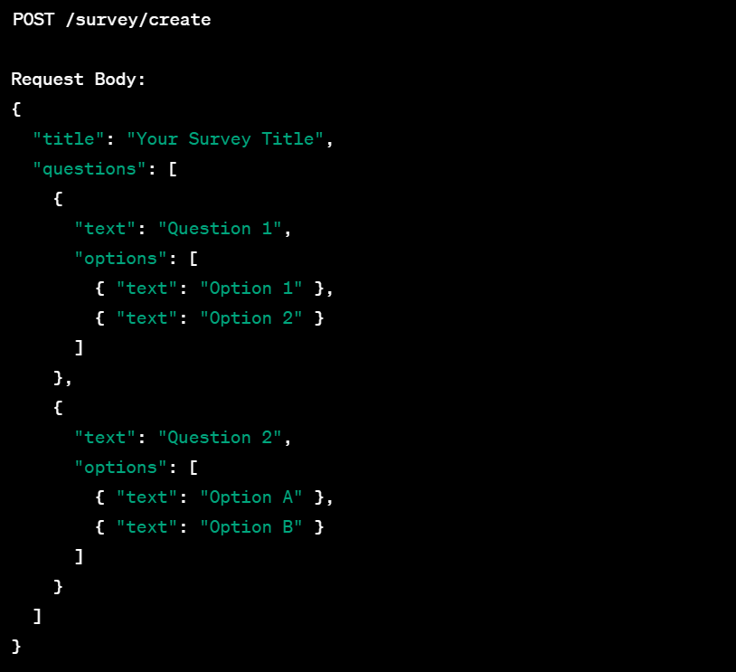

# Survey Poll App

Create a basic Survey/Poll application built with Node.js and Prisma.

## Prerequisites

Before you begin, ensure you have met the following requirements:

- You have installed Node.js and npm.
- You have installed Prisma CLI.
- You have a PostgreSQL database setup.
 

## API Endpoints

The application provides the following endpoints:

- `GET /surveys`: Fetch all surveys.
- `POST /surveys`: Create a new survey.
- `GET /surveys/:id`: Fetch a specific survey.
- `PUT /surveys/:id`: Update a specific survey.
- `DELETE /surveys/:id`: Delete a specific survey.
  


## Overview

The application allows users to create and participate in surveys. Each survey consists of one or more questions, and each question can have multiple options. Users can select an option to vote in a survey.

## Features

- Create a new survey
- Get a list of all surveys
- Get details of a specific survey
- Vote in a survey
- Get the results of a survey

## Tech Stack

- Node.js: JavaScript runtime
- Express.js: Web application framework
- Prisma: Next-generation Node.js and TypeScript ORM
- Jest: JavaScript testing framework

## Getting Started

Please follow the standard instructions to initiate a node app


- Clone the repo
  

1.change your directory
```
cd survey-poll-app
```
2.initiate a node app

```
npm init -y
```
```
npm install express prisma @prisma/client
```
3. Create Prisma schema file
   
Create a schema.prisma file in the root of your project and paste the provided schema into it.

4. Configure Database Connection
   
In the schema.prisma file, update env("DATABASE_URL") with your actual PostgreSQL database connection URL.

5. Generate Prisma Client
   
```
npx prisma generate
```
6. Create an Express App
   
7. Implement CRUD Operations 
   
Start Coding!!!


## Directory Structure

**NOTE:Please adhere to the below directory structure, follow the same naming convention for files and directories in your app(Inorder to run tests w/o any trouble)**

- Clone the repo and write your code inside `survey-poll-app`

**Ignore tests and Readme which are already present in `survey-poll-app` **

```
survey-poll-app/
|-- node_modules/
|-- prisma/
|   |-- schema.prisma
|-- src/
|   |-- controllers/
|   |   |-- surveyController.js
|   |
|   |-- models/
|   |   |-- surveyModel.js
|   |
|   |-- routes/
|   |   |-- surveyRoutes.js
|   |
|   |-- config.js
|   |-- server.js
|-- package.json
|-- .env
```

## Prisma Schema for your Reference

**Note : Not mandatory to follow this. this is just for your reference**

Just try to follow this basic structure for creating a survey




```
datasource db {
  provider = "postgresql"
  url      = env("DATABASE_URL")
}

generator client {
  provider = "prisma-client-js"
}

model Survey {
  id        Int      @id @default(autoincrement())
  title     String
  questions Question[]
}

model Question {
  id       Int      @id @default(autoincrement())
  text     String
  options  Option[]
  surveyId Int
  Survey   Survey   @relation(fields: [surveyId], references: [id])
}

model Option {
  id          Int      @id @default(autoincrement())
  text        String
  votes       Int      @default(0)
  questionId  Int
  Question    Question @relation(fields: [questionId], references: [id])
}

```


## Testing

To run the tests, use the `npm test` command.


