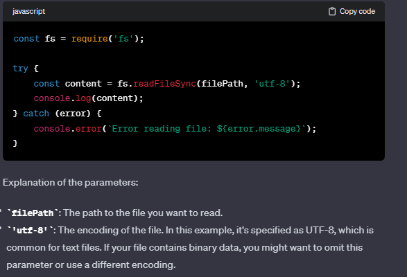

# Medium-Section :

## file-cleaner:

### **readFileSync() :**

The `readFileSync` function is part of the Node.js `fs` (File System) module, and it is used to synchronously read the entire contents of a file. The synchronous version of the function means that it blocks the execution of the code until the file reading operation is complete

## Clock :

### **padZero():**

In JavaScript, `padZero` is likely a custom function used to ensure that a numerical value, such as the hours obtained from `now.getHours()`, is represented as a two-digit string. The purpose of this function is to add a leading zero if the value is a single-digit number.

`padZero(now.getHours() % 12 || 12)` is a code snippet that calculates the 12-hour format of the current hour, pads it with a leading zero if needed, and ensures that the value is never zero but rather displays 12 for 12:00 PM (noon) and 12:00 AM (midnight).

1. `now.getHours() % 12`: Gets the current hour using `getHours()` method, and then takes the modulo 12 to get the hour in the range of 0 to 11. This is because the modulo operation (`%`) gives the remainder after division by 12.
2. `now.getHours() % 12 || 12`: If the result of the modulo operation is zero (midnight), it returns 12; otherwise, it returns the result of the modulo operation. This ensures that midnight (0:00) is represented as 12:00 AM.
3. `padZero(...)`: Calls the `padZero` function to pad the resulting hour with a leading zero if it's a single-digit number.

### now.getHours() % 12 || 12:

The expression `now.getHours() % 12 || 12` in JavaScript is used to convert the current hour from the 24-hour format to the 12-hour format, ensuring that midnight (0:00) is represented as 12:00 AM.

Here's a breakdown of how this works:

1. `now.getHours()`: Gets the current hour in the 24-hour format using the `getHours()` method of the `Date` object.`now.getHours()` is a method of the `Date` object that returns the current hour of the day (0 to 23) based on the local time zone
2. `% 12`: Performs the modulo operation by 12. This operation ensures that the result is in the range of 0 to 11. The purpose is to convert hours like 13, 14, ..., 23 to their respective 12-hour equivalents.
3. `|| 12`: If the result of the modulo operation is 0 (midnight in the 24-hour format), the `||` (logical OR) operator returns 12. Otherwise, it returns the result of the modulo operation.

This expression ensures that the result is in the range of 1 to 12, representing the 12-hour format. If the current hour is midnight (0:00), it will be represented as 12:00 AM.
