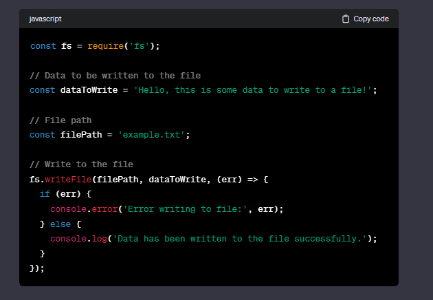

# File Server:

### path.join()

In Node.js, the path.join method is part of the built-in path module. It is used to concatenate path segments into a single path. This is especially useful for constructing file paths in a cross-platform manner, as it automatically handles the correct path separator based on the operating system.

### readdir():

In Node.js, the readdir function is part of the built-in fs (File System) module, and it is used to asynchronously read the contents of a directory.

# TODO Server :

### JEST command for finding error while test running:

    **npx jest --detectOpenHandles ./tests/todoServer.test.js**

solution :

### findIndex() and find() :

In JavaScript, the `Array.prototype.find()` and `Array.prototype.findIndex()` methods are used for finding elements in an array based on a provided testing function

## Difference between req.query.id and req.params.id :

req.query.id :

- This is used to access query parameters from the URL.
- Query parameters are typically included in the URL after the "?" symbol and are key-value pairs (e.g., `/route?id=123`).
- In the example, `req.query.id` would give you the value of the "id" parameter in the query string.

  

req.params.id :

- This is used to access route parameters (also known as path parameters or URL parameters).
- Route parameters are parts of the URL path that are defined using a colon syntax in the route definition (e.g., `/route/:id`).
- In the example, `req.params.id` would give you the value of the "id" parameter in the URL path.

  

## Node.js :

### File writing in node :

In this example:

1. `fs.writeFile()` is used to write data to a file. It takes three parameters: the file path, the data to be written, and a callback function that will be called once the write operation is complete.
2. The `err` parameter in the callback function will be `null` if the write operation is successful. If there is an error, `err` will contain information about the error.
3. Make sure to replace `'example.txt'` with the actual path and name of the file you want to write to.

If you want to append data to an existing file instead of overwriting it, you can use `fs.appendFile()`:

